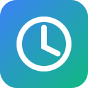

# FocusGuard

A production-ready Chrome extension that helps you stay focused by blocking distracting websites during your scheduled focus hours.



## Features

- **Smart Website Blocking**: Block distracting sites only during your focus hours
- **Customizable Schedules**: Set up multiple focus schedules for different days
- **Break System**: Emergency "Take a Break" button with 5-minute cooldown
- **Daily Statistics**: Track sites blocked and time saved
- **Motivational Quotes**: Get inspired when you hit a blocked page
- **Dark Mode**: Easy on the eyes with light/dark theme toggle
- **Dashboard**: Full-page dashboard for managing settings
- **Clean UI**: Modern, SaaS-like interface design

## Installation

### Method 1: Load Unpacked Extension

1. Download or clone this repository
2. Open Chrome and navigate to `chrome://extensions/`
3. Enable "Developer mode" using the toggle in the top right
4. Click "Load unpacked" button
5. Select the extension folder (the folder containing `manifest.json`)
6. The FocusGuard icon should appear in your Chrome toolbar

### Method 2: Chrome Web Store (Coming Soon)

FocusGuard will be available on the Chrome Web Store soon.

## Project Structure

```
focusguard-extension/
├── manifest.json          # Extension manifest (Manifest V3)
├── README.md             # This file
├── /popup/               # Popup UI files
│   ├── popup.html
│   ├── popup.css
│   └── popup.js
├── /background/          # Service worker & modules
│   ├── service-worker.js # Main background script
│   ├── storage.js        # Storage API wrapper
│   ├── utils.js          # Utility functions
│   └── rules-manager.js  # Declarative Net Request manager
├── /blocked/             # Blocked page UI
│   ├── blocked.html
│   ├── blocked.css
│   └── blocked.js
├── /dashboard/           # Full-page dashboard
│   ├── dashboard.html
│   ├── dashboard.css
│   └── dashboard.js
├── /rules/               # DNR rules
│   └── rules.json
└── /assets/              # Icons and images
    ├── icon.svg
    ├── icon-16.png.svg
    ├── icon-32.png.svg
    ├── icon-48.png.svg
    └── icon-128.png.svg
```

## Usage

### Getting Started

1. Click the FocusGuard icon in your Chrome toolbar to open the popup
2. Add distracting websites to your block list
3. Set up your focus schedule (e.g., 9:00 AM - 5:00 PM on weekdays)
4. FocusGuard will automatically block those sites during your scheduled hours

### Managing Blocked Sites

- **Add a site**: Enter the domain (e.g., `facebook.com`) and click Add
- **Remove a site**: Click the X button next to the site in the list
- Sites are normalized (removes `www.`, `https://`, etc.)

### Setting Up Schedules

1. Go to the "Schedule" tab in the popup
2. Select your start and end times
3. Choose which days of the week to apply the schedule
4. Click "Add Schedule"
5. You can create multiple schedules for different times/days

### Taking a Break

When you encounter a blocked page:
- Click "Back to Work" to return to your previous page
- Click "Take a 5 Min Break" to temporarily disable blocking
- The break button has a 5-minute cooldown between uses

### Dashboard

Access the full dashboard by clicking "Open Dashboard" in the popup footer. The dashboard provides:
- Overview of your productivity stats
- Full management of blocked sites
- Complete schedule management
- Settings and preferences

## Technical Details

### Architecture

- **Manifest V3**: Uses the latest Chrome extension manifest version
- **Service Worker**: Background script handles schedule checking and rule management
- **Declarative Net Request**: Efficient blocking without intercepting all web requests
- **Chrome Storage API**: Persistent storage for settings and statistics
- **ES Modules**: Modern JavaScript module system for clean code organization

### APIs Used

- `chrome.storage` - Data persistence
- `chrome.declarativeNetRequest` - Website blocking
- `chrome.alarms` - Schedule checking
- `chrome.action` - Extension popup and badge
- `chrome.tabs` - Tab management

### Code Quality

- Fully modular ES6+ JavaScript
- Comprehensive JSDoc comments
- Error handling throughout
- No external dependencies
- Clean separation of concerns

## Browser Compatibility

FocusGuard is built for Chrome and Chromium-based browsers:
- Google Chrome (version 88+)
- Microsoft Edge (version 88+)
- Brave Browser
- Opera
- Other Chromium-based browsers with Manifest V3 support

## Privacy

FocusGuard respects your privacy:
- All data is stored locally in your browser
- No data is sent to external servers
- No analytics or tracking
- Open source code you can audit

## Development

### File Structure

The extension follows a modular architecture:

- **Storage Module** (`background/storage.js`): All Chrome Storage API operations
- **Utils Module** (`background/utils.js`): Helper functions and constants
- **Rules Manager** (`background/rules-manager.js`): DNR rule management
- **Service Worker** (`background/service-worker.js`): Background tasks and alarms

### Adding Features

To extend FocusGuard:

1. Modify the appropriate module in `/background/`
2. Update the UI in `/popup/`, `/blocked/`, or `/dashboard/`
3. Update `manifest.json` if new permissions are needed
4. Reload the extension in `chrome://extensions/`

## Troubleshooting

### Extension Not Blocking Sites

1. Check that sites are added correctly (domain only, no `https://`)
2. Verify your schedule includes the current day and time
3. Ensure the extension has permission to access sites
4. Try reloading the extension from `chrome://extensions/`

### Statistics Not Updating

- Stats reset daily at midnight
- Ensure the extension is enabled
- Check that blocking is actually occurring

### Schedule Not Working

- Verify your system time is correct
- Check that at least one day is selected
- Ensure start time is before end time
- For overnight schedules, times will span midnight automatically

## License

MIT License - Feel free to use, modify, and distribute.

## Contributing

Contributions are welcome! Please:

1. Fork the repository
2. Create a feature branch
3. Make your changes
4. Submit a pull request

## Support

If you encounter issues:

1. Check the troubleshooting section above
2. Open an issue on GitHub
3. Include your Chrome version and steps to reproduce

---

**Stay focused, be productive!**
